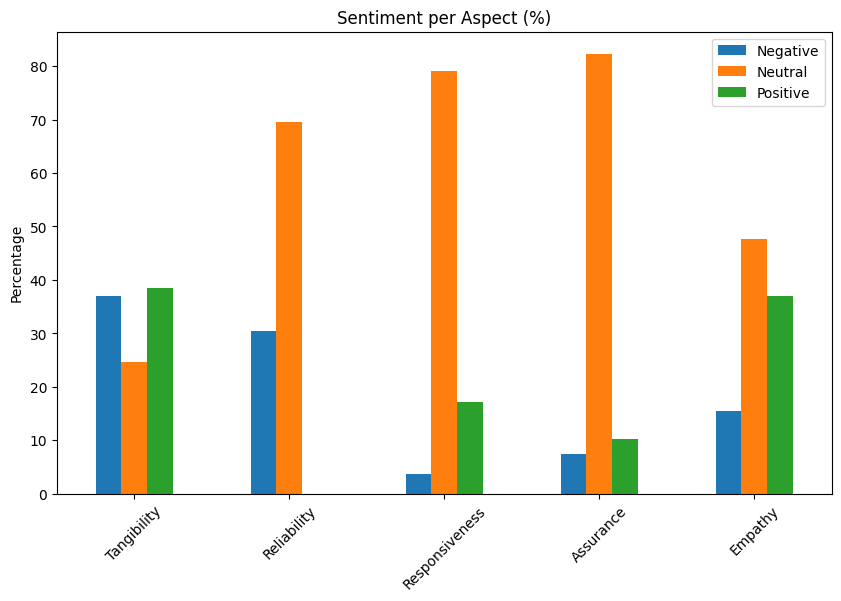
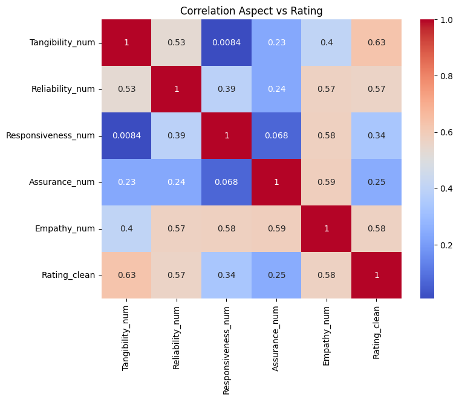

# Hotel Customer Satisfaction Analysis Using Aspect-Based Sentiment Analysis (ABSA)

## Deskripsi Proyek

Dalam industri perhotelan, ulasan pelanggan pada platform Online Travel Agent (OTA) seperti Agoda dan Traveloka merupakan sumber informasi penting untuk memahami tingkat kepuasan pelanggan. Namun, data ulasan berbentuk teks tidak terstruktur sehingga sulit dianalisis secara langsung.

Pada proyek ini dilakukan Aspect-Based Sentiment Analysis (ABSA) berbasis Artificial Intelligence (AI) untuk mengidentifikasi sentimen pelanggan terhadap berbagai aspek layanan hotel. Analisis ini bertujuan untuk membantu manajemen hotel memahami faktor-faktor yang paling mempengaruhi kepuasan pelanggan dan menyusun strategi peningkatan kualitas layanan.

---

## Tujuan Analisis

* Mengidentifikasi sentimen pelanggan terhadap berbagai aspek layanan hotel.
* Mengukur tingkat kepuasan pelanggan berdasarkan ulasan OTA.
* Menentukan aspek layanan yang paling mempengaruhi rating pelanggan.
* Memberikan rekomendasi strategis untuk meningkatkan kualitas layanan dan rating hotel.

---

## Latar Belakang Bisnis

Analisis sentimen secara umum hanya memberikan gambaran positif atau negatif secara keseluruhan. Pendekatan tersebut sering kali tidak mampu menunjukkan aspek layanan mana yang menjadi sumber kepuasan atau ketidakpuasan pelanggan.

Oleh karena itu, digunakan pendekatan Aspect-Based Sentiment Analysis (ABSA) untuk mengklasifikasikan sentimen berdasarkan lima dimensi kualitas layanan:

1. Tangibility
2. Reliability
3. Responsiveness
4. Assurance
5. Empathy

Kelima aspek tersebut diadaptasi dari konsep kualitas layanan (SERVQUAL) yang banyak digunakan dalam evaluasi kualitas layanan industri perhotelan.

---

## Dataset

Dataset berupa kumpulan ulasan pelanggan hotel yang diperoleh dari platform OTA seperti:

* Agoda
* Traveloka

Data yang dianalisis berupa teks ulasan pelanggan dan rating yang diberikan terhadap hotel.

---

## Tools & Technologies

* Python
* Pandas
* Google Colab
* OpenAI API / AI Model
* Matplotlib
* Seaborn

---

## Metodologi

### 1. Data Preprocessing

Tahapan preprocessing dilakukan untuk membersihkan dan menyiapkan data ulasan sebelum dianalisis.

Proses meliputi:

* Pembersihan teks
* Normalisasi data
* Penghapusan karakter tidak relevan

### 2. Aspect Classification

Setiap ulasan dikategorikan ke dalam lima aspek layanan:

| Aspek          | Deskripsi                               |
| -------------- | --------------------------------------- |
| Tangibility    | Fasilitas, kebersihan, kenyamanan kamar |
| Reliability    | Konsistensi dan kesesuaian layanan      |
| Responsiveness | Kecepatan dan kesigapan pelayanan       |
| Assurance      | Profesionalisme dan kepercayaan         |
| Empathy        | Keramahan dan perhatian staf            |

### 3. Sentiment Classification

Setiap aspek diklasifikasikan ke dalam:

* Positive
* Neutral
* Negative

menggunakan pendekatan Artificial Intelligence.

### 4. Visualization & Analysis

Hasil klasifikasi divisualisasikan untuk menghasilkan insight bisnis dan rekomendasi strategis.

---

## Hasil Analisis

### Distribusi Sentimen per Aspek

Hasil analisis menunjukkan bahwa:

* Tangibility memiliki proporsi sentimen negatif tertinggi.
* Reliability, Responsiveness, dan Assurance didominasi sentimen netral.
* Empathy memiliki proporsi sentimen positif tertinggi.

### Insight

Aspek fasilitas dan kondisi fisik hotel masih menjadi sumber utama ketidakpuasan pelanggan.

Sebaliknya, interaksi staf dengan pelanggan menjadi kekuatan utama yang diapresiasi oleh tamu hotel.

---

## Analisis Korelasi terhadap Rating Pelanggan

Dilakukan analisis korelasi untuk mengidentifikasi aspek yang paling berpengaruh terhadap rating hotel.

### Hasil Korelasi

| Aspek          | Korelasi terhadap Rating |
| -------------- | ------------------------ |
| Empathy        | 0.58                     |
| Reliability    | 0.57                     |
| Responsiveness | Lebih rendah             |
| Assurance      | Lebih rendah             |
| Tangibility    | Lebih rendah             |

### Insight

Empathy dan Reliability merupakan faktor yang paling mempengaruhi tingkat kepuasan pelanggan.

Perbaikan pada kedua aspek tersebut berpotensi memberikan dampak terbesar terhadap peningkatan rating hotel.

---

## Business Insight

### Temuan Utama

* Tangibility memiliki sentimen negatif tertinggi (±38%).
* Reliability, Responsiveness, dan Assurance didominasi sentimen netral (70–82%).
* Empathy memiliki sentimen positif tertinggi (±37%).
* Empathy dan Reliability menjadi faktor utama yang mempengaruhi rating pelanggan.

### Dampak Bisnis

Temuan ini menunjukkan bahwa kepuasan pelanggan tidak hanya dipengaruhi oleh fasilitas hotel, tetapi juga kualitas interaksi dan konsistensi pelayanan yang diberikan.

---

## Rekomendasi

### Tangibility

Melakukan perbaikan fasilitas fisik hotel seperti:

* Kebersihan kamar
* Kualitas fasilitas pendukung
* Kenyamanan lingkungan hotel

### Reliability

Meningkatkan konsistensi layanan agar sesuai dengan ekspektasi pelanggan.

### Assurance

Memberikan pelatihan kepada staf untuk meningkatkan profesionalisme pelayanan.

### Empathy

Mempertahankan budaya pelayanan yang ramah dan berorientasi pada pelanggan sebagai keunggulan kompetitif hotel.

### Responsiveness

Melakukan evaluasi berkala terhadap kecepatan pelayanan dan penanganan permintaan pelanggan.

---

## Kesimpulan

Analisis Aspect-Based Sentiment Analysis (ABSA) menunjukkan bahwa kualitas layanan hotel masih memiliki beberapa area yang perlu ditingkatkan, terutama pada aspek Tangibility.

Sementara itu, aspek Empathy dan Reliability terbukti menjadi faktor yang paling mempengaruhi kepuasan pelanggan dan rating hotel. Oleh karena itu, strategi peningkatan kualitas layanan perlu difokuskan pada perbaikan fasilitas fisik, konsistensi layanan, dan penguatan interaksi positif antara staf dan pelanggan.

---

## Visualisasi

### Distribusi Sentimen Pelanggan per Aspek

### Korelasi Aspek terhadap Rating Pelanggan

---

## Skill yang Ditunjukkan

* Data Cleaning
* Natural Language Processing (NLP)
* Aspect-Based Sentiment Analysis (ABSA)
* Artificial Intelligence (AI)
* Text Analytics
* Data Visualization
* Customer Analytics
* Hospitality Analytics
* Business Insight Generation

---

## Author

Shofia Nabila

Studi Independen Data Analyst | Vinix7

Sistem Informasi Kelautan | Universitas Pendidikan Indonesia
Data Analyst Portfolio
